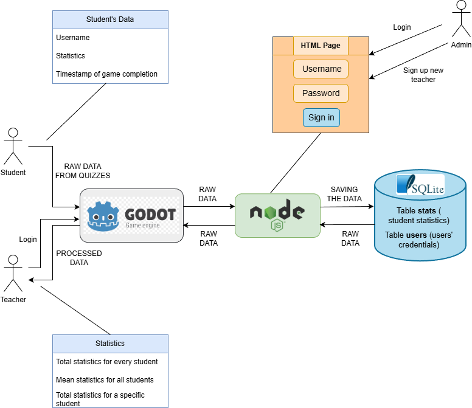

# Knowledge Quest
## An educational maths game developed in Godot & enhanced with AI technologies


In this project I developed a desktop video game for educational purposes, using the Godot game engine. **Knowledge Quest** is an educational game designed for children ages 6-12 that focuses on strengthening their mathematics skills. The game features multiple-choice quizzes that progress from basic mathematical operations (addition, subtraction, multiplication, etc) to more advanced topics such as fractions, rational and irrational numbers and other challenging problems.

The game includes eye-catching visuals, concentration-friendly music and an engaging story that unfolds, as players advance through the levels. To explore how AI can enhance video game development, I used some AI models and tools to generate content such as narration, images as well as text-to-speech audio and more. At the end of each level, players receive performance statistics which are also accessible from the pause menu of the game. These statistics allow students to evaluate their performance. Also, teachers can monitor the progress of their students, by signing in the game with their credentials.

### Technologies
The technologies that were used in this project are:
* **Godot Engine** - The game development environment
* **Python** - Used in AI experiments and statistical analysis
* **R** - Used for the statistical analysis process
* **AI Models/Tools** - ChatGPT, Gemini, Suno & ElevenLabs for AI generated narration, images, music, SFX, voices and quizzes
* **NodeJS** - The framework for the backend server
* **SQLite** - The database for the data storage
* **GIMP** - Used for image editing

Here is an image that depicts the architecture of this system:


### Installation Guide 
A step-by-step guide on how to install the required modules and run this project.

1. Download **Godot 4.3** or a newer version from https://godotengine.org/download/. <br>
⚠️ Make sure you are using version 4.3 or higher, as older versions are not compatible with this project.

2. Download and set up **NodeJS** and **SQLite**, using the directions provided in this [NodeJS and Database Install](server/nodejs%20and%20database%20install.txt).

3. **Clone** this github repository to your local machine.
```
git clone https://github.com/MariaAgalou/Knowledge_Quest.git
```

4. Navigate to the **project's directory** in your local filesystem.
```
cd C:\Users\Path\To\Project\Directory
```

5. **Launch** Godot, **import** the project and then run the game by clicking **Play** for the debugging version or export the project as a **desktop executable**.

Have fun playing!! 🎮🎮
